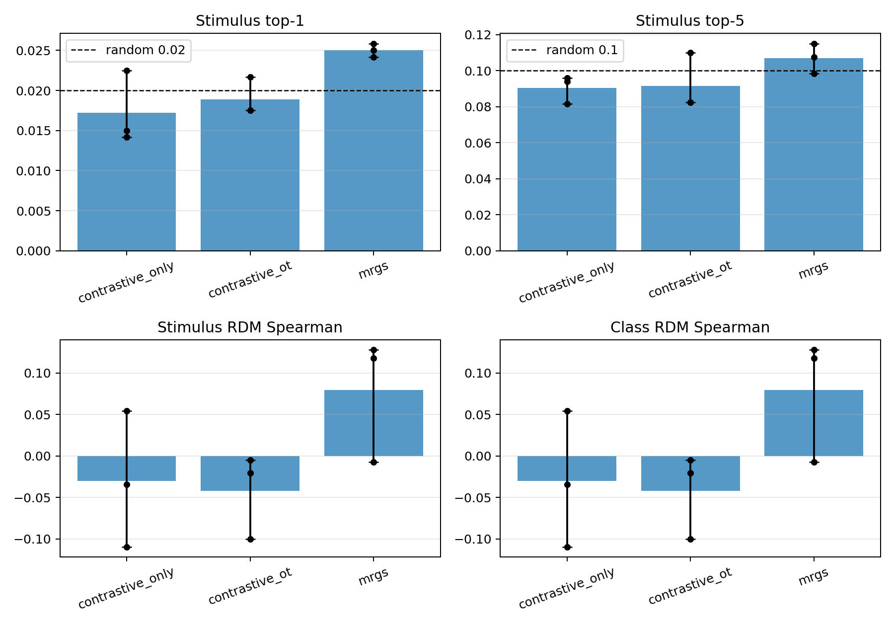

# Mental Representation-Guided Supervision Baseline

Compact PyTorch baseline for
[Human-like cognitive generalization for large models via mental representation-guided supervision](https://www.nature.com/articles/s41467-026-71267-5).
Original project: [JxuanC/mental-representation-guided-learning](https://github.com/JxuanC/mental-representation-guided-learning).

This repo implements a minimal paired fMRI/image-feature pipeline: frozen image
features, an image projection head, an fMRI encoder, Sinkhorn matching, RDM
alignment, and stimulus-aware evaluation. It is not a full reproduction: it
omits full Gromov-Wasserstein graph matching, Gumbel-Softmax local graph
sampling, WordNet/THINGS/COCO evaluations, and model-scale sweeps.



Diagnostic S1-S3 DIR result, using audited `vgg19_pool5_fallback` features and
`VC` fMRI. MRGS is modestly above random on stimulus retrieval and strongest on
mean RDM, but this is not an OpenCLIP/HVC paper-aligned result.

## Install

```bash
python -m pip install -r requirements.txt
```

Device selection is automatic. Override with `--device mps`, `cuda`, or `cpu`.

## Smoke Test

```bash
python -m mrgs.train \
  --config configs/minimal_clip.yaml \
  --synthetic \
  --subject S1 \
  --epochs 3 \
  --batch-size 64
```

## Data

Sources:

- DIR / OpenNeuro: <https://openneuro.org/datasets/ds001506/versions/1.3.1>
- Preprocessed fMRI / figshare: <https://figshare.com/articles/dataset/Deep_Image_Reconstruction/7033577>
- ImageNet: <https://image-net.org/download>
- Synset archives: `https://image-net.org/data/winter21_whole/[synsetid].tar`

Download figshare metadata/files:

```bash
python scripts/download_dir_metadata.py --download --out data/raw/DIR
```

Preprocess DIR:

```bash
python scripts/prepare_dir.py --raw data/raw/DIR --out data/processed --roi HVC
```

Processed files contain:

```python
{
    "image_paths": list[str],
    "class_ids": torch.LongTensor,
    "class_names": list[str],
    "fmri": torch.FloatTensor,
    "subject": str,
    "split": str,
}
```

If real image paths are missing, `image_paths` stores stimulus IDs. Training can
still use audited cached feature files.

## Image Features

OpenCLIP extraction:

```bash
python scripts/extract_image_features.py \
  --processed data/processed/S1_train.pt \
  --output features/S1_train_features.pt \
  --backend open_clip \
  --device mps
```

Light fallback:

```bash
python scripts/extract_image_features.py \
  --processed data/processed/S1_train.pt \
  --output features/S1_train_features.pt \
  --backend mobilenet_v3_small
```

Feature files must carry `image_paths` so paired fMRI rows can be audited:

```python
{
    "image_paths": list[str],
    "features": torch.FloatTensor,
    "backend": str,
    "model_name": str,
}
```

Audit before training:

```bash
python scripts/audit_dir_alignment.py \
  --processed data/processed/S1_test.pt \
  --features features/S1_test_features.pt
```

The audit accepts exact row-aligned features or one feature row per unique
stimulus. Bare tensors and class-replacement images are rejected for paired
retrieval metrics.

## Lightweight ImageNet Subset

Download only DIR synset archives. The script does not automate ImageNet login;
provide cookies only if you have valid access. A browser extension such as
`Get cookies.txt LOCALLY` can export `cookies.txt`.

```bash
python scripts/download_imagenet_synsets.py \
  --synsets data/sources/dir_synsets.txt \
  --out data/raw/imagenet_synsets \
  --cookies cookies.txt \
  --limit 5

python scripts/extract_imagenet_subset.py \
  --archives data/raw/imagenet_synsets \
  --out data/images/imagenet_synsets \
  --max-images-per-synset 8
```

Do not use replacement class images for paired retrieval; use exact stimulus
images or audited figshare features.

## Train And Evaluate

Train:

```bash
python -m mrgs.train \
  --config configs/minimal_clip.yaml \
  --subject S1 \
  --processed-dir data/processed \
  --feature-dir features \
  --device mps
```

Evaluate:

```bash
python scripts/eval_subject.py \
  --checkpoint outputs/S1/last.pt \
  --processed data/processed/S1_test.pt \
  --features features/S1_test_features.pt \
  --device mps
```

Metrics include row, stimulus, and class retrieval plus row/stimulus/class RDM
Spearman correlations.

## S1 Comparison

Run loss ablations on audited S1 features:

```bash
python scripts/run_comparison_s1.py \
  --processed-dir data/processed \
  --feature-dir features \
  --device mps \
  --epochs 10 \
  --batch-size 64 \
  --output-root outputs/comparison_s1_vgg19_vc
```

Methods: `contrastive_only`, `contrastive_ot`, `mrgs`.

Plot:

```bash
python scripts/plot_comparison.py --root outputs/comparison_s1_vgg19_vc
```

Outputs include `summary.csv`, stimulus/class retrieval charts, RDM charts, and
training curves. Use `VC` and `vgg19_pool5_fallback` labels unless HVC masks or
exact-image OpenCLIP features are available and pass audit.

## Development

```bash
python -m pytest
```

## Citation

```bibtex
@article{chen2026human,
  title={Human-like cognitive generalization for large models via mental representation-guided supervision},
  author={Chen, Jiaxuan and Qi, Yu and Wang, Yueming and Pan, Gang},
  journal={Nature Communications},
  year={2026},
  publisher={Nature Publishing Group UK London}
}
```
